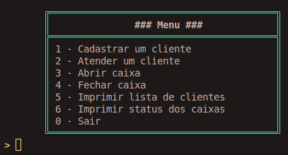
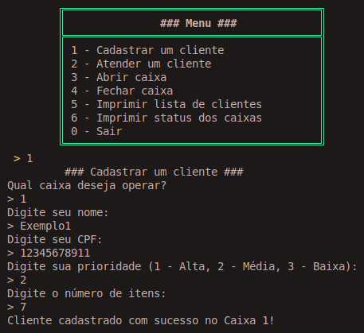
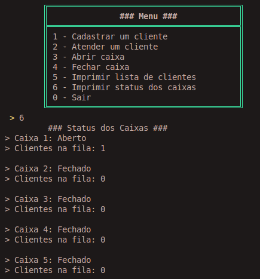
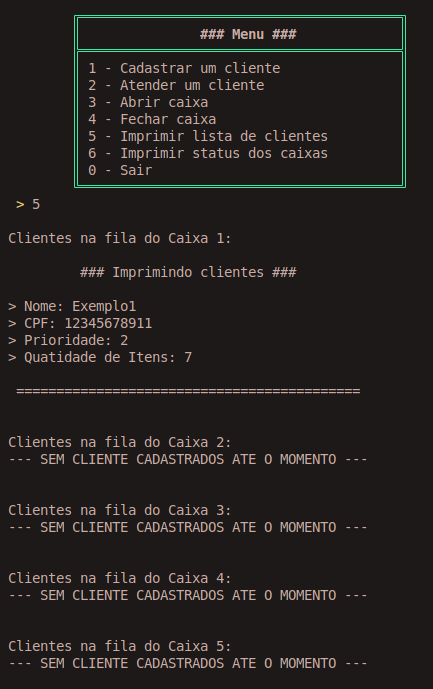
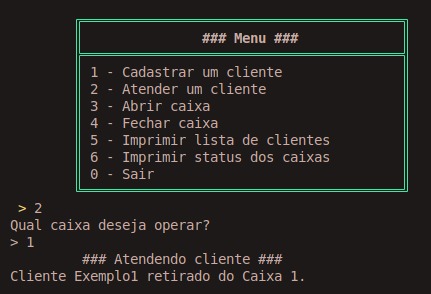

<h1 align="center" font-size="200em"><b>Sistema de Gestão de Filas em Supermercado</b></h1>

<!-- imagem -->

## 📌Sumário
- [Introdução](#Introdução)
- [Objetivos](#Objetivos)
- [Arquivos](#Arquivos)
- [Resolução do Problema](#Resolução-do-problema)
- [Resultados](#Resultados)
- [Conclusão](#Conclusão)
- [Referências](#Referências)
- [Compilação e execução](#Compilação-e-execução)
- [Contato](#Contato)

## ✒️Introdução

Este é um programa desenvolvido em C para a disciplina complementar de Introdução a Programação de Computadores.  
Este projeto visa implementar um sistema de gerenciamento de filas eficiente e justo utilizando a linguagem de programação C, com estruturas de dados como listas encadeadas e filas prioritárias.

## 💻Objetivos

O objetivo deste projeto é desenvolver um sistema funcional para gerenciar filas em supermercados, garantindo eficiência e justiça no atendimento. Especificamente, busca-se:
- Criar um sistema de filas com suporte à priorização.
- Implementar funcionalidades para cadastro e atendimento de clientes.
- Permitir o gerenciamento de caixas, incluindo abertura e fechamento.
- Oferecer relatórios detalhados sobre clientes e status dos caixas.
 
## 📄Arquivos
- <strong>main.c:</strong> Realizada a chamada das funções necessários para o funcionamento com a exibição do menu.
- <strong>includes.h:</strong> Inclusão das bibliotecas e arquivos utilizados.
- <strong>structs.h:</strong> Criação das structs que serão utilizadas no projeto.
- <strong>fila.h:</strong> Declaração das funções que utilizam as filas.
- <strong>fila.c:</strong> Desenvolvimento das funções que utilziam as filas.
- <strong>caixa.h:</strong> Declaração das funções que o caixa realiza.
- <strong>caixa.c:</strong> Desenvolvimento das funções que o caixa realiza.
- <strong>cliente.h:</strong> Declaração das funções dos clientes.
- <strong>cliente.c:</strong> Desenvolvimento das funções dos clientes.

## 🔨Resolução do problema
Durante o desenvolvimento do sistema de gestão de filas para supermercados, foram identificados e resolvidos diversos desafios técnicos e lógicos.

**Organização de Clientes com Prioridades Diferentes** 
_Problema:_ Garantir que clientes com maior prioridade fossem atendidos antes dos demais, sem comprometer a ordem de chegada dentro de cada nível de prioridade.

_Solução:_ Foi implementada uma estrutura de fila prioritária com listas encadeadas. Cada cliente foi classificado em três níveis de prioridade(1 - Alta, 2 - Média, 3 - Baixa), e as funções de inserção e remoção foram otimizadas para respeitar essa ordem.

**Gerenciamento Dinâmico dos Caixas** 
_Problema:_ Reorganizar as filas dos clientes quando um caixa era fechado, distribuindo-os entre os caixas abertos restantes e com menor numero de clientes.

_Solução:_ Uma lógica foi criada para transferir os clientes da fila de um caixa fechado para os caixas abertos, priorizando os que possuem menos clietes na fila, respeitando suas prioridades e distribuindo a carga de forma equilibrada.

**Estruturação dos Dados** 
_Problema:_ Garantir que as estruturas de dados utilizadas (clientes, caixas, filas) fossem eficientes e fáceis de manipular.

_Solução:_ O projeto utilizou listas encadeadas para armazenar os dados dos clientes, permitindo inserções e remoções dinâmicas sem a necessidade de realocar memória.

**Interface com o Usuário** 
_Problema:_ Criar uma interface clara e intuitiva para que os usuários pudessem realizar as operações disponíveis, como cadastro de clientes, atendimento, abertura/fechamento de caixas e exibição de relatórios.

_Solução:_ Um menu interativo foi desenvolvido no main, oferecendo opções numeradas e um loop contínuo até a escolha de saída do programa.

**Validação e Consistência dos Dados** 
_Problema:_ Evitar entradas inválidas, como prioridade fora do intervalo permitido ou dígito diferente do menu.

_Solução:_ Foram adicionadas verificações em todas as operações de entrada para garantir a consistência dos dados fornecidos pelos usuários.

**Testes e Depuração** 
_Problema:_ Identificar e corrigir erros em situações específicas, como transferência de clientes entre caixas ou atendimento fora de ordem de prioridade.

_Solução:_ Foram realizados testes exaustivos com diferentes cenários e tamanhos de filas, utilizando casos de teste representativos das operações do sistema.

## 🎯Resultados
O sistema desenvolvido oferece um menu interativo para iniciar e realizar todas as operações. O fluxo e os resultados principais do programa são descritos a seguir:

**Menu Inicial:** O programa exibe um menu com opções claras para realizar operações, como cadastrar clientes, atender clientes, abrir/fechar caixas, visualizar filas e sair do programa.

  
  
<em> Menu para o usuário escolher uma das opções.</em>

**Estado Inicial dos Caixas:** Todos os caixas começam abertos, permitindo que o cliente escolha em qual deles será inserido.

**Cadastro de Clientes:** Ao cadastrar um cliente, o sistema solicita as seguintes informações:
- Nome
- CPF
- Prioridade (1 - alta, 2 - média, 3 - baixa)
- Número de itens no carrinho

  
  
<em>Cadastro de um cliente.</em>

_Após o cadastro, o cliente é adicionado à fila do caixa escolhido com base na sua prioridade._

**Fechamento de Caixas:** Após o cadastro do primeiro cliente, os caixas restantes são fechados automaticamente. É necessário abrir manualmente outros caixas para permitir que novos clientes sejam direcionados a eles.

**Visualização de Filas:** O programa permite visualizar a fila de clientes em cada caixa, organizada por prioridade. Também é possível visualizar o estado (aberto ou fechado) de todos os caixas.
- Imprimindo fila de caixas:

  
  
<em>Impressão da lista de caixas.</em>

- Imprimindo fila de clientes:

  
  
<em>Impressão da lista de clientes.</em>

**Abertura e Fechamento de Caixas:** O usuário pode abrir ou fechar caixas conforme necessário. Quando um caixa é fechado, os clientes em sua fila são realocados para outros caixas abertos.

**Atendimento de Clientes:** É possível atender um cliente, removendo-o da fila do seu respectivo caixa.

  
  
<em>Impressão da lista de clientes.</em>

**Encerramento do Programa:** O programa encerra suas operações ao selecionar a opção de saída no menu.

## ✔️Conclusão
Este projeto demonstrou a aplicação prática de estruturas de dados e algoritmos para resolver problemas do mundo real. A implementação do sistema de gerenciamento de filas mostrou-se eficiente para organizar o atendimento em supermercados, destacando o uso de filas prioritárias e listas encadeadas. O trabalho proporcionou um aprendizado valioso em lógica de programação, organização de código e estruturação de sistemas interativos. Uma boa atividade que agregou meus conheciementos e melhorou minhas praticas de programação.

## 🗂️Referências
- https://www.sololearn.com/en/Discuss/2032268/what-is-alternative-of-cin-ignore-used-in-c-in-c
- https://wagnergaspar.com/como-implementar-a-estrutura-de-dados-fila-de-prioridade-em-c/

## 👾Compilação e execução
* Especificações da máquina em que o código foi rodado:
  * Processador Intel Core i7, 12th Gen;
  * Sistema Operacional Ubuntu 22.04.5;
  * 16GB de RAM.
* | Comando                |  Função                                                                                           |                     
  | -----------------------| ------------------------------------------------------------------------------------------------- |
  |  `make clean`          | Apaga a última compilação realizada contida na pasta build                                        |
  |  `make`                | Executa a compilação do programa utilizando o gcc, e o resultado vai para a pasta build           |
  |  `make run`            | Executa o programa da pasta build após a realização da compilação                                 |

## ✉️Contato

 
 Jullia Fernandes Felizardo

 <a href="https://t.me/JulliaFernandes">
  
 

<a style="color:black" href="mailto:julliacefet@gmail.com?subject=[GitHub]%20Source%20Dynamic%20Lists">
✉️ <i>julliacefet@gmail.com</i>
</a>
